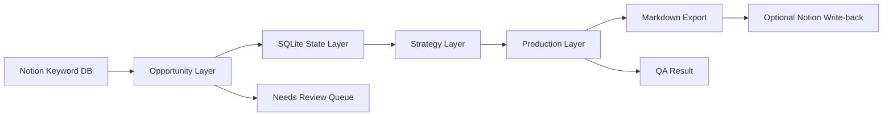

# SEO Opportunity Workspace Architecture

## 1. 架构目标

第一版架构目标不是构建通用 SEO 平台，而是支撑一个稳定、可解释、可演示的最小闭环。

核心原则：

- 按页面机会而不是按单关键词生产
- 策略层优先做规则驱动，AI 负责解释和生成
- 生产层先导出，不强依赖 CMS 发布

## 2. 总体分层



## 3. 模块说明

### 3.0 运行环境决策

第一版系统设计正式确定为：

- 应用形态：Web app
- 源数据：Notion
- 状态层：SQLite
- 执行方式：应用内 API / 本地服务函数
- 输出：Markdown，后续可选写回 Notion

不采用：

- n8n 作为主工作流引擎
- Claude skill 作为主执行环境
- 纯本地脚本作为主交互入口

### 3.1 数据读取模块

职责：

- 从 Notion 数据库读取记录
- 将字段映射到内部对象
- 过滤空值和无效记录

输入：

- `main_keyword`
- `keyword`
- `keyword_variants`
- `all_keywords`
- `page_brief`
- `topic_cluster_name`
- `volume`
- `kd`
- `same_page_group_id`
- `content_type`
- `content_type_llm`
- `intent`
- `priority`
- `internal_link_role`
- `url`
- `createdTime`

输出：

- 原始记录数组

### 3.1.1 状态层

职责：

- 持久化 production run 状态
- 保存 `brief_v2`、`article_draft`、`qa_result`
- 为前端提供可恢复的状态流

推荐表结构：

```ts
type OpportunityRun = {
  groupId: string;
  status: "idle" | "brief_ready" | "draft_ready" | "qa_pass" | "qa_fail" | "exported";
  briefV2: string;
  articleDraft: string;
  qaPassed: boolean;
  qaIssues: string[];
  updatedAt: string;
};
```

### 3.2 Opportunity Layer

职责：

- 按 `same_page_group_id` 聚合记录
- 为每组生成统一的页面机会对象
- 补齐页面类型决策

规则：

- 聚合键使用 `same_page_group_id`
- 页面类型优先用 `content_type`
- 若 `content_type` 为待分类或为空，则回退到 `content_type_llm`
- 若两者都不可用，则标记为 `needs_review`
- `priority` 不作为聚合或页面类型判断依据
- `needs_review` 项不进入自动生产流程

输出对象：

```ts
type PageOpportunity = {
  groupId: string;
  mainKeyword: string;
  keyword: string;
  allKeywords: string;
  keywordVariants: string;
  topicClusterName: string;
  intent: string;
  contentType: string;
  volume: number;
  kd: number;
  variantCount: number;
  internalLinkRole: string;
  pageBrief: string;
  sourceUrls: string[];
};
```

### 3.3 Strategy Layer

职责：

- 为页面机会计算优先级
- 生成本周任务单
- 输出人可读的推荐理由

推荐实现：

- 先用规则计算 `opportunity_score`
- 再用 LLM 生成 `why_now`
- 所有权重从外部配置文件读取，读取顺序：
  1. `config/scoring-engine.json` — 通用评分函数
  2. `config/presets/[preset].json` — 阶段 × 类型权重基准
  3. `config/projects/[project].json` — 项目局部覆盖（`weight_overrides`）

建议评分项：

- `volume_score`
- `kd_penalty`
- `intent_score`
- `content_type_score`
- `internal_link_role_score`
- `variant_count_score`
- `brief_readiness_score`

字段使用规则：

- 核心输入：`volume`, `kd`, `intent`, `contentType`, `internalLinkRole`, `variantCount`, `pageBrief`
- 参考输入：`priority`, `topicClusterName`
- 不作为主决策输入：`keyword`, `createdTime`, `url`

输出对象：

```ts
type StrategyTask = {
  groupId: string;
  opportunityScore: number;
  priorityBand: "high" | "medium" | "low";
  whyNow: string;
  recommendedAction: string;
};
```

### 3.4 Production Layer

职责：

- 根据页面机会生成 `brief_v2`
- 根据 `brief_v2` 生成文章初稿
- 执行基础 QA
- 更新 SQLite 中的运行状态

输入：

- `mainKeyword`
- `keyword`
- `allKeywords`
- `keywordVariants`
- `intent`
- `contentType`
- `topicClusterName`
- `internalLinkRole`
- `pageBrief`

输出对象：

```ts
type ProductionAsset = {
  briefV2: string;
  articleDraft: string;
  qaResult: {
    passed: boolean;
    issues: string[];
  };
};
```

### 3.5 QA Layer Rules

第一版 QA 只做可量化规则，不做复杂语义打分。

规则：

- `main_keyword` 必须出现在 H1
- `all_keywords` 中至少 60% 出现在正文
- 首段必须与 `intent` 匹配
- 正文长度必须大于等于 800 words
- 必须包含至少 1 个内部链接占位

输出：

```ts
type QaResult = {
  passed: boolean;
  issues: string[];
};
```

## 4. 字段映射

### 4.1 Notion -> Opportunity

- `same_page_group_id` -> `groupId`
- `main_keyword` -> `mainKeyword`
- `keyword` -> `keyword`
- `all_keywords` -> `allKeywords`
- `keyword_variants` -> `keywordVariants`
- `topic_cluster_name` -> `topicClusterName`
- `intent` -> `intent`
- `content_type` / `content_type_llm` -> `contentType`
- `volume` -> `volume`
- `kd` -> `kd`
- `variant_count` -> `variantCount`
- `internal_link_role` -> `internalLinkRole`
- `page_brief` -> `pageBrief`
- `url` -> `sourceUrls[]`

### 4.1.1 字段职责

- 主展示字段：`main_keyword`, `topic_cluster_name`, `volume`, `kd`, `intent`, `contentType`, `internal_link_role`
- 聚合与去重字段：`same_page_group_id`, `url`, `variant_count`
- 生产输入字段：`all_keywords`, `keyword_variants`, `page_brief`, `keyword`
- 辅助决策字段：`content_type_llm`, `priority`, `createdTime`

### 4.2 Opportunity -> Strategy

- `volume`, `kd` -> 排序基础
- `intent` -> 商业意图权重
- `contentType` -> 页面价值权重
- `internalLinkRole` -> 站内结构权重
- `variantCount` -> 覆盖范围权重
- `pageBrief` -> 生产成本权重
- `priority` -> 仅作参考，不直接决定排序

### 4.3 Strategy -> Production

- `recommendedAction` 决定是否生成内容
- 高优先级任务进入 `brief_v2`
- `whyNow` 仅作为策略解释，不进入正文内容

## 5. 异常流程

### 5.1 页面组缺失

如果 `same_page_group_id` 缺失：

- 第一版将其作为单独机会处理
- 同时标记为 `needs_review`

### 5.2 页面类型未定

如果 `content_type` 与 `content_type_llm` 都无效：

- 不进入自动生产
- 仅进入待审核列表

### 5.3 Brief 为空

如果 `page_brief` 为空：

- 仍可生成 `brief_v2`
- 但降低优先级，避免第一版生产层过度依赖自由生成

### 5.4 QA 不通过

如果 QA 不通过：

- 不允许进入导出完成态
- 显示失败原因并退回到 brief 或 draft 阶段

## 6. 技术边界

- 前端：单工作台形态
- 数据源：Notion
- 状态层：SQLite
- 第一版不强制写回 Notion
- 模型：单模型接入，避免多模型调度复杂度
- 输出：Markdown 优先

## 6.1 字段优先级规则

- `same_page_group_id` 是第一版唯一页面聚合主键
- `content_type` 优先于 `content_type_llm`
- `priority` 是人工参考字段，不直接覆盖策略评分
- `url` 当前只用于追踪与去重，不进入第一版策略评分

## 6.2 UI 主流程决策

- 第一版主工作台采用 Pipeline 视角
- `prototype.html` 是主流程方向
- `keyword-opportunity-view.html` 作为补充浏览视图，不作为主工作台

## 6.3 needs_review 出口

`needs_review` 项进入独立队列，至少暴露以下信息：

- `groupId`
- `mainKeyword`
- `reason`
- `suggestedFix`

人工操作：

- 指定 `content_type`
- 补 `same_page_group_id`
- 标记 `skip`

## 7. 第一版页面结构

### 7.1 Opportunities

展示聚合后的页面机会列表。

### 7.2 Strategy Queue

展示分数、优先级、推荐原因、本周任务。

### 7.3 Production Panel

展示原始 brief、生成的新 brief、文章初稿、QA 和导出动作。

## 8. 演进路线

第二阶段可继续增加：

- 写回 Notion 的状态字段
- CMS 发布
- 竞品动态输入
- 周计划自动排程
- 更细的内容 QA 和内链建议
