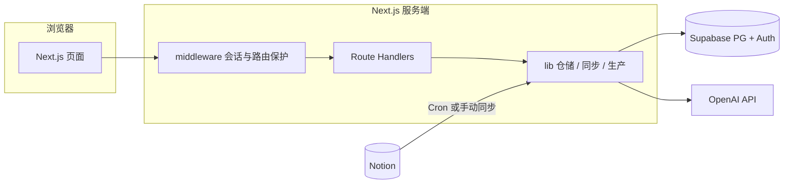

# 技术选型与技术架构

本文描述 **SEO Opportunity Workspace** 仓库的总体技术选型、分层结构与数据流，便于 onboarding 与评审。细节以代码与根目录 `README.md` 为准。

## 技术选型

| 层级 | 选型 | 说明 |
|------|------|------|
| 应用框架 | Next.js 16（App Router） | 页面与 Route Handlers 同仓，默认构建使用 Webpack（`next build --webpack`） |
| 运行时 UI | React 19 + TypeScript | 组件与类型安全 |
| 样式 | Tailwind CSS v4 + `@tailwindcss/postcss` | 工具类样式 |
| 组件与动效 | shadcn/ui（含 `@base-ui/react`）+ Motion | 工作台界面与动画 |
| 工具库 | `clsx`、`tailwind-merge`、`class-variance-authority`、`lucide-react` | 类名合并、变体、图标 |
| 数据库与 BaaS | Supabase（PostgreSQL + Auth） | 数据快照、扩展字段、Brief 记录、用户角色 |
| Supabase 客户端 | `@supabase/ssr`、`@supabase/supabase-js` | 服务端 / 中间件 / 浏览器会话与数据访问 |
| 外部数据源 | Notion（`@notionhq/client`） | 关键词库真源；同步写入 Supabase |
| AI | OpenAI API | Brief、草稿等生成逻辑位于 `lib/production/openai-*.ts`；支持 `OPENAI_BRIEF_MODEL`、`OPENAI_BASE_URL`、`OPENAI_HTTP_PROXY` 等环境变量 |
| 认证 | Supabase Auth + Google OAuth | 中间件刷新 cookie 会话；可选 Google One Tap（`NEXT_PUBLIC_GOOGLE_CLIENT_ID`） |
| 授权 | 自建角色 viewer / editor / admin | 与 `AUTH_ADMIN_EMAILS` 及迁移中的角色表配合 |
| 代码质量 | ESLint 9 + `eslint-config-next` | `npm run lint` |
| 部署与定时 | Vercel | `vercel.json` 中配置 Cron，调用 `/api/cron/notion-sync`（当前 schedule：`0 0 * * *`，UTC 每日零点） |

## 仓库结构（与架构相关的部分）

- `app/`：App Router 页面、`app/api/**` Route Handlers。
- `lib/supabase/`：Supabase 服务端客户端、中间件会话、仓储与表名约定。
- `lib/notion/`、`lib/sync/`：Notion 拉取与 Notion → Supabase 同步。
- `lib/opportunity/`、`lib/scoring/`：机会聚合、工作流状态、打分等。
- `lib/production/`：Brief、草稿、why_now、QA、导出及 OpenAI 调用封装。
- `lib/auth/`：服务端用户、角色、管理员校验。
- `supabase/migrations/`：数据库迁移（执行顺序与表说明见根目录 `README.md`）。

## 分层架构

### 1. 表现层

- 路由示例：`/`、`/login`、`/auth/callback`、`/workbench`、`/brief-records`、`/admin/access`、`/unauthorized`。
- 根目录 `middleware.ts` 调用 `lib/supabase/middleware.ts` 更新 Supabase 会话，并对受保护页面与 API 做重定向或 `401`。

### 2. API 层（Route Handlers）

- 机会与生产：`/api/opportunities`、`/api/opportunities/[groupId]`、`/api/opportunities/[groupId]/generate`、`/api/opportunities/[groupId]/brief-records` 等。
- Brief 记录：`/api/brief-records/[recordId]`。
- 管理：`/api/admin/user-roles/[userId]`、管理向同步相关接口（见 `app/api/admin/`）。
- 同步与定时：`GET /api/cron/notion-sync`、`GET`/`POST /api/sync/notion`；需 `Authorization: Bearer <CRON_SECRET>`（与 `lib/api/cron-auth.ts` 一致）。

### 3. 领域与集成层（`lib/`）

- 数据访问通过 `lib/supabase/*`（含 `opportunity-repository` 等），敏感写操作可使用 service role（`lib/supabase/admin-client.ts`）。
- Notion 同步入口为 `lib/sync/sync-notion-to-supabase.ts`，配合 `lib/notion/*` 完成映射与拉取。
- 内容生成统一在 `lib/production/*`，避免在页面组件中直接调用外部 AI。

### 4. 数据与外部系统

- **Notion**：关键词库真源；同步任务 upsert `seo_page_opportunities` 并清理已删除快照。
- **Supabase `seo_page_opportunities`**：机会列表快照；`GET /api/opportunities` 等默认数据源。
- **Supabase `seo_opportunity_supplements`**：工作台 workflow、Brief/草稿/why_now 等扩展字段，按 `group_id` 与快照合并。
- **Supabase `seo_brief_generation_records`**：每次 brief 生成的输入快照与输出 Markdown；检索字段见对应迁移。
- **OpenAI**：仅服务端调用，密钥通过环境变量注入，不暴露给浏览器。

## 安全边界（与中间件一致）

- **公开**：`/`、`/login`、`/auth/callback`、`/unauthorized`。
- **需登录页面**：路径前缀 `/workbench`、`/brief-records`、`/admin`。
- **需登录 API**：路径前缀 `/api/opportunities`、`/api/brief-records`、`/api/admin`；无会话时返回 `401`。
- **Cron / 同步 API**：`/api/cron/*`、`/api/sync/*` 在中间件中不按「页面登录」拦截，由 Handler 内 Bearer 等机制校验。

## 数据流示意

## 相关文档

- 产品与环境、迁移列表、API 列表：根目录 [`README.md`](../README.md)
- Brief 规范与 prompt 模板：`doc/brief-spec-by-content-type.md`、`doc/brief-generation-prompt.md` 等
